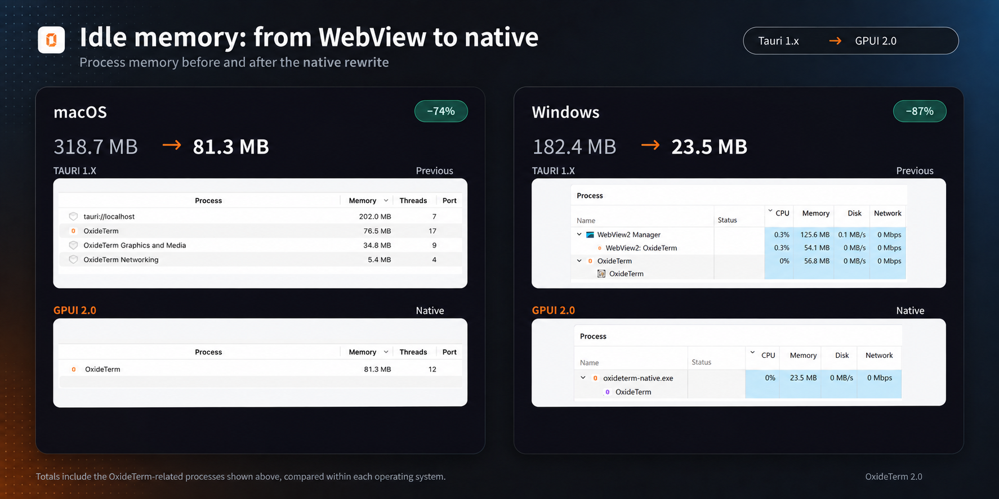

<div align="center">


# ⚡ OxideTerm

**Um cliente SSH nativo e gratuito e um espaço de trabalho para operações remotas, com um assistente de IA que usa sua própria chave.**

SSH · Mosh · Telnet · Serial · RDP/VNC · SFTP · encaminhamento de portas · editor integrado, tudo em um único aplicativo com renderização por GPU.
Sem conta. Sem assinatura. Sem telemetria. Sem Electron.

[](https://github.com/liansishen/oxideterm/releases/latest)
[](#install)
[](../../LICENSE)
[](https://github.com/AnalyseDeCircuit/oxideterm/stargazers)

[**Baixar**](https://github.com/liansishen/oxideterm/releases/latest) ·
[**Documentação**](https://oxideterm.app) ·
[**Histórico de alterações**](../../.github/release-notes/stable-changelog.md) ·
[**Relatar um problema**](https://github.com/AnalyseDeCircuit/oxideterm/issues)

[English](../../README.md) | [简体中文](README.zh-Hans.md) | [繁體中文](README.zh-Hant.md) | [日本語](README.ja.md) | [한국어](README.ko.md) | [Français](README.fr.md) | [Deutsch](README.de.md) | [Español](README.es.md) | [Italiano](README.it.md) | [Português](README.pt-BR.md) | [Tiếng Việt](README.vi.md)

</div>

---

## Primeiros passos

1. **Instale o OxideTerm.** Baixe um pacote da [última versão](https://github.com/liansishen/oxideterm/releases/latest); as orientações por plataforma estão em [Instalação](#install), abaixo.
2. **Adicione um servidor.** Abra o Gerenciador de Sessões e crie uma conexão SSH ou importe os hosts do seu `~/.ssh/config`.
3. **Conecte-se.** Abra um terminal. As chaves dos hosts são verificadas em relação ao `~/.ssh/known_hosts`.
4. **Use os outros recursos do espaço de trabalho.** Abra o SFTP, o encaminhamento de portas ou o editor integrado no mesmo nó. Por padrão, eles compartilham uma única conexão SSH.
5. **Opcional: ative a IA.** Nas Configurações, adicione seu próprio endpoint OpenAI, Anthropic, Gemini, Ollama ou compatível com OpenAI para habilitar o OxideSens.

Para conhecer o aplicativo em mais detalhes, consulte a [documentação](https://oxideterm.app).

---

## Recursos disponíveis

| | |
|---|---|
| **Terminais e protocolos** | Shells locais, SSH, Mosh, Telnet, Serial, painéis divididos, rotas com vários saltos, agente SSH e encaminhamento de agente, credenciais 2FA e TOTP, encaminhamento X11, integração com o shell, marcações de comandos, registros de sessão configuráveis, gravação, gráficos Sixel e Kitty, transferências trzsz |
| **tmux e transmissão simultânea** | Modo de controle nativo `tmux -CC` com layouts de painéis e divisórias arrastáveis, grupos nomeados para transmissão simultânea e um emissor avançado de comandos para vários destinos, com entradas agendadas e repetíveis |
| **Confiabilidade** | A reconexão Grace Period mantém os aplicativos TUI ativos durante quedas breves de rede e depois restaura encaminhamentos, transferências e arquivos abertos no editor |
| **Arquivos e edição** | Gerenciador SFTP com dois painéis, filas de transferência com limites de velocidade e estimativa de conclusão, favoritos e um editor remoto integrado com gravação segura, tratamento de conflitos e restauração do espaço de trabalho |
| **Rede** | Encaminhamento local, remoto e dinâmico SOCKS5, regras salvas, detecção de portas remotas, topologia de conexões, depuração pontual de sockets |
| **Área de trabalho remota** | RDP e VNC integrados, com suporte a entrada e área de transferência |
| **Operações nos hosts** | Monitoramento de processos, serviços, registros, portas, tarefas, discos, pacotes, contêineres e tmux |
| **IA e automação** | OxideSens com sua própria chave, MCP, RAG local, Agent Skills, ações aprovadas no espaço de trabalho e uma CLI independente |
| **Revisão e auditoria** | Espaço de trabalho opcional de Notificações e Auditoria e gravações de sessão criptografadas (ambos desativados por padrão) |
| **Sincronização e portabilidade** | Sincronização em nuvem criptografada, pacotes portáteis `.oxide` |
| **Personalização** | Temas, imagens de fundo, atalhos configuráveis, Comandos Rápidos, 11 idiomas de interface |

---

## Por que usar o OxideTerm

- **Gratuito, com prioridade para o uso local.** Sem conta, assinatura ou telemetria. Suas conexões e seus dados operacionais permanecem sob seu controle.
- **Um espaço de trabalho por servidor.** Terminal, SFTP, encaminhamento, RDP/VNC, editor, monitoramento e IA se vinculam ao mesmo nó, em vez de funcionar como utilitários desconectados.
- **Nativo, sem um navegador disfarçado.** A interface é desenhada diretamente na GPU com [GPUI](https://github.com/zed-industries/zed/tree/main/crates/gpui). Não há Electron nem WebView incluído.
- **IA nos seus termos.** O OxideSens usa seu próprio provedor e sua chave e só executa ações que você aprova.
- **Conexões resilientes.** A reconexão Grace Period testa a conexão antiga por 30 segundos antes de substituí-la, permitindo que aplicativos TUI sobrevivam a quedas breves de rede.
- **SSH inteiramente em Rust.** A implementação SSH usa `russh` com `ring`, sem OpenSSL nem libssh2.

---

## Uso de memória

**A reescrita nativa reduziu o uso de memória em repouso para cerca de um quarto da versão antiga no macOS e um oitavo no Windows.** Estes são os resultados registrados pelo mantenedor durante a mudança do Tauri 1.x para o GPUI nativo 2.0:

| Plataforma | Tauri 1.x (em repouso) | Nativo 2.0 (em repouso) | Redução |
|---|---:|---:|---:|
| macOS | 318.7 MB | 81.3 MB | Cerca de 74% |
| Windows | 182.4 MB | 23.5 MB | Cerca de 87% |

O total da versão antiga inclui o OxideTerm e os processos WebView associados. A versão nativa não precisa mais desses processos de navegador.



---

## Capturas de tela

| Terminal SSH com OxideSens | Gerenciador de arquivos SFTP |
|---|---|
|  |  |

| IDE integrada | Encaminhamento inteligente de portas |
|---|---|
|  |  |

<details>
<summary><b>Veja o OxideSens abrir um terminal a partir de um pedido em linguagem natural</b></summary>

<a href="../../docs/media/ai-terminal-demo.mp4">
  
</a>

</details>

---

## IA OxideSens

O OxideSens é um assistente opcional que pode examinar suas sessões ativas e executar ações no espaço de trabalho **somente após sua aprovação**.

- **Use sua própria chave.** Compatível com OpenAI, Anthropic (Claude), Google Gemini, Ollama e qualquer endpoint compatível com OpenAI, com controles de raciocínio específicos de cada provedor. Não há créditos da plataforma.
- **MCP e Agent Skills.** Conecte servidores MCP (stdio e SSE) e carregue Agent Skills com escopo limitado.
- **Base de conhecimento local (RAG).** Busca de texto completo BM25 combinada com um índice vetorial.
- **Você controla o contexto.** Você escolhe quais contextos e ações do espaço de trabalho serão aprovados, e as regras de política de comandos se aplicam.
- **Remoção de credenciais.** As mensagens enviadas a um provedor passam por um filtro que remove padrões de credenciais.
- **As chaves ficam no chaveiro do sistema operacional** e não entram nos registros estruturados.

---

<a id="plugins"></a>
## Plugins

O OxideTerm oferece três formas de executar plugins:

| Tipo | Como funciona | Limite |
|---|---|---|
| **Somente manifesto** | Extensões declarativas, sem código | Sem código executável |
| **WASM** | Wasmtime/WASI ou um processo auxiliar | Chamadas controladas ao host, limitadas por capacidades |
| **Processo** | Um processo local comum | Código local confiável, **sem** isolamento pelo sistema operacional |

Plugins ESM legados do Tauri (1.x) podem aparecer na lista, mas não são executados pelo aplicativo nativo 2.x. Instale plugins de processo apenas de fontes confiáveis.

---

## Segurança e privacidade

| Assunto | Como funciona |
|---|---|
| **Credenciais armazenadas** | Chaveiro do sistema operacional (macOS Keychain, Windows Credential Manager, libsecret) |
| **Segredos na memória** | Tipos que contêm segredos e buffers temporários usam `zeroize` nos limites de propriedade suportados |
| **Chaves dos hosts** | Confiança no primeiro uso com `~/.ssh/known_hosts`; alterações inesperadas são rejeitadas |
| **Exportações portáteis** | Os pacotes `.oxide` usam ChaCha20-Poly1305 com Argon2id (256 MB de memória, 4 iterações) |
| **Contexto da IA** | Remoção de padrões de credenciais antes de qualquer envio ao provedor; você aprova o contexto e as ações |
| **Gravações de sessão** | Desativadas por padrão; armazenadas criptografadas no seu dispositivo e excluídas da sincronização em nuvem; a entrada do teclado não é capturada |
| **Auditoria** | Desativada por padrão; os dados permanecem no seu dispositivo, com detalhes sensíveis criptografados |
| **Alterações pela CLI** | Planos de simulação, proteção com `--yes` e backups para reversão de comandos que alteram o estado |
| **Plugins** | Consulte [Plugins](#plugins) |
| **Telemetria** | Nenhuma |

**Uso legal.** O OxideTerm é licenciado sob GPL-3.0-only, sem restrições adicionais. Acesse apenas sistemas, redes e dispositivos que sejam seus ou para os quais você tenha autorização explícita, e cumpra a legislação aplicável. Não use o OxideTerm para acesso não autorizado, interrupção de serviços ou para contornar controles de acesso.

---

## Limitações atuais

É melhor saber antes de instalar:

- Apenas para desktop (macOS, Windows, Linux). Não há aplicativo móvel.
- O projeto evolui rapidamente, com lançamentos frequentes. Consulte o [histórico de alterações](../../.github/release-notes/stable-changelog.md) e os [problemas em aberto](https://github.com/AnalyseDeCircuit/oxideterm/issues).
- Auditoria e gravação de sessões precisam ser ativadas e refletem apenas o que o próprio OxideTerm consegue observar.
- Plugins de processo não têm isolamento pelo sistema operacional.
- Se a renderização falhar na sua máquina, tente o perfil de compatibilidade: `OXIDETERM_RENDER_PROFILE=compatibility`.

---

<a id="for-developers"></a>
## Para desenvolvedores

<details>
<summary><b>Executar a partir do código-fonte</b></summary>

**Requisitos:** Ferramentas Rust (edição 2024) e um ambiente desktop capaz de executar GPUI.

```bash
# Run the app
cargo run

# If the renderer fails on your machine
OXIDETERM_RENDER_PROFILE=compatibility cargo run

# Build the headless CLI companion
./scripts/build/build-cli.sh

# Build the optional Linux remote agent
./scripts/build/build-agent.sh
```

Com Nix: `nix build .#oxideterm`, `nix run .#oxideterm` ou `nix develop`.

Os binários da CLI são gerados em `crates/oxideterm-gpui-app/resources/cli-bin/<target-triple>/oxideterm`.

</details>

<details>
<summary><b>Interface de linha de comando</b></summary>

A CLI `oxideterm`, sem interface gráfica, funciona sem iniciar o aplicativo, o que é útil para automação, CI e diagnóstico. Ela abrange configurações, conexões, encaminhamentos, plugins, comandos rápidos, segredos, pacotes portáteis, diagnósticos, relatórios, planos em lote, backups e sincronização em nuvem.

```bash
cargo run -p oxideterm-cli -- doctor --strict
cargo run -p oxideterm-cli -- settings validate --strict --json
cargo run -p oxideterm-cli -- connections search prod
cargo run -p oxideterm-cli -- forwards list --format json
cargo run -p oxideterm-cli -- cloud-sync push --dry-run --json
cargo run -p oxideterm-cli -- oxide export ./profile.oxide --connection prod --password-stdin
cargo run -p oxideterm-cli -- report --bundle ./oxideterm-report.zip
cargo run -p oxideterm-cli -- completion install zsh --force

# Path and profile isolation for CI or fixtures
cargo run -p oxideterm-cli -- --config-dir ./fixture-config doctor --strict
```

</details>

<details>
<summary><b>Arquitetura</b></summary>

A interface e o backend de terminal/SSH compartilham um único processo Rust; agentes remotos opcionais e auxiliares de plataforma ficam fora desse processo. Os bytes do terminal modificam `TerminalState` diretamente, e o GPUI renderiza a partir desse estado, sem uma etapa de análise de JSON, WebSocket, Base64 ou xterm.js.

```
┌─────────────────────────────────────────────────┐
│               GPUI Render Loop                  │
│   WorkspaceApp  ·  Tab surfaces  ·  GPUI views  │
└──────────────────────┬──────────────────────────┘
                       │  in-process Arc<> / async
┌──────────────────────▼──────────────────────────┐
│             Domain Crates (Rust async)          │
│  NodeRouter → SshConnectionRegistry             │
│  TerminalState ← SSH PTY channel (russh)        │
│  SftpSession · ForwardingRuntime · IdeWorkspace │
│  Ai/ACP Entities · CloudSync · Plugin Runtimes  │
└─────────────────────────────────────────────────┘
```

| Aspecto | Abordagem com navegador incluído | OxideTerm |
|---|---|---|
| Renderização | Motor de navegador e layout web | GPUI em uma superfície GPU |
| Fluxo de dados do terminal | WebSocket → loop de eventos JS → xterm.js | Entrada Rust → `TerminalState` → renderização GPUI |
| Ciclo de vida da conexão | Dividido entre frontend e backend | Uma única conexão e fluxo de reconexão no mesmo processo |
| Contexto da IA | Copiado por uma ponte do aplicativo | Construído a partir do espaço de trabalho ativo, com aprovação do usuário |
| CLI | Exige que o aplicativo desktop esteja em execução | Binário independente, com ligação direta às crates |

**Pool de conexões.** `SshConnectionRegistry` usa `DashMap` e é acessado por meio de `NodeRouter`. Painéis de terminal, SFTP, encaminhamentos de portas e o editor podem compartilhar uma única conexão SSH física por nó; uma política de terminal também pode optar por uma conexão dedicada. Cada conexão percorre os estados `connecting → active → idle → link_down → reconnecting`. Uma falha no host de salto marca os nós dependentes como `link_down`. IA e plugins usam identificadores de capacidades e snapshots do host, em vez de se registrarem como consumidores da conexão.

**Reconexão Grace Period.**

1. Detecta um tempo limite de keepalive.
2. Salva um snapshot dos painéis de terminal, transferências SFTP, encaminhamentos e arquivos do editor.
3. Testa a conexão antiga por 30 s para que aplicativos TUI possam sobreviver a quedas breves de rede.
4. Abre uma nova conexão, restaura os encaminhamentos, retoma as transferências e reabre os arquivos do editor.

As sessões SFTP carregam uma geração de conexão: após uma reconexão, uma sessão elegível é readquirida, mas uma operação de uma geração antiga nunca é transferida silenciosamente para a nova conexão.

**Encaminhamento de portas.** Uma crate independente com suporte a `-L`, `-R` e `-D` (SOCKS5). Uma única tarefa `ssh_io` é responsável por cada canal SSH, sem mutex compartilhado no caminho de execução mais frequente.

**SSH inteiramente em Rust.** `russh` com `ring`: SSH2 completo, ChaCha20-Poly1305 e AES-GCM, chaves Ed25519/RSA/ECDSA, agente SSH no Unix (`SSH_AUTH_SOCK`) e Windows (`\\.\pipe\openssh-ssh-agent`), além de cadeias de vários saltos com autenticação independente por salto.

**Tecnologias utilizadas**

| Camada | Tecnologia |
|---|---|
| Interface | GPUI (framework de interface do Zed com suporte a GPU) |
| Execução | Tokio, DashMap |
| SSH | `russh` com `ring` (sem OpenSSL nem libssh2) |
| PTY local | `portable-pty` (ConPTY no Windows) |
| Emulação de terminal | `alacritty_terminal` (VT100–VT500, Sixel, gráficos Kitty) |
| Editor | Destaque de sintaxe com tree-sitter, buffer próprio |
| Criptografia | ChaCha20-Poly1305, Argon2id |
| Plugins | Wasmtime/WASI, WASM em processo auxiliar e execução por processo |
| Streaming de IA | SSE (OpenAI, Anthropic, Gemini), no mesmo processo |
| RAG | BM25 + índice vetorial HNSW com fusão de rankings e tokenização CJK por bigramas |
| Internacionalização | `oxideterm-i18n` (11 idiomas) |

</details>

---

## Versões e downloads do fork OxideTerm

Este fork tem versões e publicações próprias, separadas do [projeto upstream](https://github.com/AnalyseDeCircuit/oxideterm). Os builds estão nas [releases do OxideTerm](https://github.com/liansishen/oxideterm/releases). O aplicativo permite configurar um proxy de atualizações.

As alterações específicas incluem os arquivos Windows ConPTY `conpty.dll` e `OpenConsole.exe` ao lado do executável, a restauração da árvore de sessões, fontes alternativas CJK e a integração da barra de título à janela.

<a id="install"></a>

## Instalação

[**Baixar a última versão**](https://github.com/liansishen/oxideterm/releases/latest)

| Sistema operacional | x64 | ARM64 |
|---|---|---|
| **macOS** | DMG (Intel) | DMG (Apple Silicon) |
| **Windows** | Instalador (`.exe`) | Instalador (`.exe`) |
| **Linux** | AppImage · `.deb` · `.rpm` | AppImage · `.deb` · `.rpm` |

Verifique o download com o arquivo `sha256sums.txt` disponível na página da versão. Os arquivos portáteis e as assinaturas também estão listados lá.

### macOS

Se o Gatekeeper bloquear o aplicativo, remova o atributo de quarentena:

```bash
xattr -cr /Applications/OxideTerm.app
```

### Windows

Se o SmartScreen exibir um aviso, escolha **Mais informações → Executar assim mesmo**.

### Linux

```bash
# AppImage
chmod +x OxideTerm_*_linux_*.AppImage && ./OxideTerm_*_linux_*.AppImage

# Debian / Ubuntu
sudo dpkg -i OxideTerm_*_linux_*.deb && sudo apt-get install -f

# Fedora / RHEL-compatible
sudo dnf install ./OxideTerm_*_linux_*.rpm

# Nix; updates are managed by Nix
nix run github:AnalyseDeCircuit/oxideterm
```

Prefere compilar por conta própria? Consulte **Executar a partir do código-fonte** em [Para desenvolvedores](#for-developers).

---

## Como contribuir

Contribuições são bem-vindas: código Rust, documentação, traduções, plugins, testes e reprodução de problemas. Abra uma issue primeiro para discutir mudanças maiores.

Relatos de bugs são mais úteis quando incluem um pacote de diagnóstico com os dados sensíveis removidos:

```bash
cargo run -p oxideterm-cli -- report --bundle ./oxideterm-report.zip
```

Bugs reproduzíveis e regressões têm prioridade. Solicitações de recursos são avaliadas pelo escopo, pela segurança e pela adequação à proposta do OxideTerm como espaço de trabalho para servidores remotos. Se o OxideTerm ajuda no seu trabalho, uma estrela no GitHub, um relato de bug reproduzível, uma correção de tradução ou um plugin ajudam o projeto a continuar evoluindo.

### Colaboradores

Obrigado a todos que ajudam a tornar o OxideTerm melhor.

<p align="center">
  <a href="https://github.com/AnalyseDeCircuit/oxideterm/graphs/contributors">
    
  </a>
</p>

---

## Licença

**GPL-3.0-only.** As atribuições das dependências estão em [`THIRD_PARTY_NOTICES.md`](../../THIRD_PARTY_NOTICES.md), com avisos adicionais em [`NOTICE`](../../NOTICE).

**Feito com:** [russh](https://github.com/warp-tech/russh) · [GPUI](https://github.com/zed-industries/zed/tree/main/crates/gpui) · [alacritty_terminal](https://github.com/alacritty/alacritty) · [portable-pty](https://github.com/wez/wezterm/tree/main/pty) · [wasmtime](https://wasmtime.dev/) · [tree-sitter](https://tree-sitter.github.io/)
